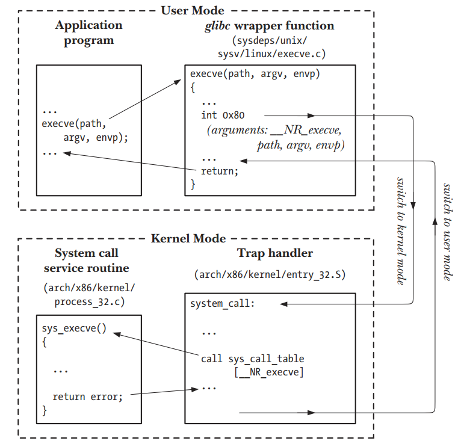

# Chapter 3: System Programming Concepts

This chapter gives the essential basics you need before starting real system programming in Linux/UNIX.

## System Calls

* The main way a program talks to the kernel (e.g., open a file, read from disk, create a new process).
* The book explains the steps that happen when a system call is executed.

## Library Functions

* Not everything directly uses the kernel.
* Sometimes library functions (like those in **glibc**) wrap system calls or provide extra features.
* The chapter shows the differences between system calls and library functions.

## Error Handling

* Always check the return value of a system call or library function.
* The book introduces standard ways to check errors (like using **errno**) and provides helper functions to report errors.

## Portability

* Writing code that can run on different UNIX/Linux systems.
* Requires **feature test macros** and using **standard system data types**.

---
## 3.1 System Calls
---

A **system call** is the official way for a program to ask the **kernel** to do something on its behalf. Programs can’t directly touch hardware or kernel memory, so they use system calls as a controlled entry point.

### What system calls do:

* Create new processes.
* Perform input/output (I/O).
* Set up communication between processes (like pipes).

### General rules:

* **User mode → Kernel mode:**
  When a system call happens, the CPU switches from user mode to kernel mode so the kernel can safely access protected resources.

* **Fixed set of calls:**
  The list of system calls is fixed, and each one has a unique number. (Programs usually use names, not numbers.)

* **Arguments transfer:**
  System calls often take arguments to send data from the program (user space) to the kernel (kernel space), and sometimes return results back.

👉 **In short:** a system call is the bridge between a user program and the kernel, making low-level system services accessible in a safe way.

---
## System Call Execution (x86-32 example)
---
From a programmer’s view, a system call looks like calling a normal C function. But internally, several hidden steps happen:

### 1. Wrapper Function (C Library)

* The program doesn’t call the kernel directly.
* Instead, it calls a wrapper function in the C library, which handles the low-level details.

### 2. Preparing Arguments

* The program passes arguments on the stack.
* The kernel expects them in specific CPU registers.
* The wrapper moves the arguments from the stack into those registers.

### 3. System Call Number

* Every system call has a unique number (e.g., read = 3, write = 4).
* The wrapper loads this number into the `%eax` register so the kernel knows which service is requested.

### 4. Trap Instruction

* The wrapper executes a trap instruction (`int 0x80`) to switch from user mode → kernel mode.
* This tells the CPU to jump to the kernel’s system call handler.
* On newer CPUs, `sysenter` is used instead of `int 0x80` (faster).

### 5. Inside the Kernel (system\_call routine)

When the CPU traps into the kernel (location `0x80`):

(a) Save registers onto the kernel stack.

(b) Validate the system call number.

(c) Find the right system call service routine from `sys_call_table` and:

* Validate arguments (e.g., check memory addresses).
* Perform the requested task (may transfer data between user and kernel memory).
* Return a result status.

(d) Restore registers from the kernel stack.

(e) Return to the wrapper function and switch back to user mode.

### 6. Wrapper Function (return handling)

* If the system call result = error → wrapper sets the global variable `errno`.
* Return value rules in Linux:

  * Success → nonnegative value.
  * Error → negative value (negated errno).
* Wrapper:

  * Negates the value, copies it into `errno`, and returns `-1` to the caller.

⚠️ Exception: some system calls (like `fcntl()` with `F_GETOWN`) can validly return negative values, but this usually doesn’t cause conflicts with error codes.

---
## Extra Notes on System Calls (execve example)
---

### Example with execve()
- On Linux/x86-32, `execve()` is system call number **11** (`__NR_execve`).  
- In the `sys_call_table`, entry **11** points to `sys_execve()`, the kernel routine that implements this call.  
- Service routines usually follow the naming format `sys_xyz()`.

### System call overhead
- Even a “simple” system call requires multiple steps, which means some overhead.  
- Example:  
  - `getppid()` → returns the parent process ID.  
  - On Linux 2.6.25 (x86-32), **10 million calls** took about **2.2 seconds** → ~0.3 microseconds per call.  
  - By comparison: **10 million plain C function calls** took only **0.11 seconds** (~20× faster).  
  - Most system calls cost even more than `getppid()`.

### Terminology in the book
- Saying “invoke the system call `xyz()`” usually means:  
  *Calling the C library wrapper that invokes the real system call routine.*

### Tracing system calls
- The `strace` tool can show which system calls a program makes (useful for debugging or investigation).

---

## Figure 3-1

Steps in the execution of a system call (example with `execve()`):

---

## 3.2 Library Functions

* **Definition:**
  Functions provided by the **standard C library** (libc).

* **Purpose:**
  Handle diverse tasks like:

  * Opening files (`fopen`)
  * Converting time to readable format
  * Comparing strings (`strcmp`)
  * Allocating memory (`malloc`, `free`)

* **Relation to system calls:**

  * Some library functions **don’t use system calls** (e.g., string manipulation functions like `strlen`, `strcpy`).
  * Others are **wrappers around system calls**, offering a friendlier interface.

* **Examples:**

  * `fopen()` → uses the `open()` system call.
  * `printf()` → uses `write()` but adds formatting & buffering.
  * `malloc()` / `free()` → manage memory using the `brk()` system call, but add bookkeeping for ease.

* **Key Idea:**
Library functions often **abstract away low-level system calls** to make programming **simpler, safer, and more portable**.

